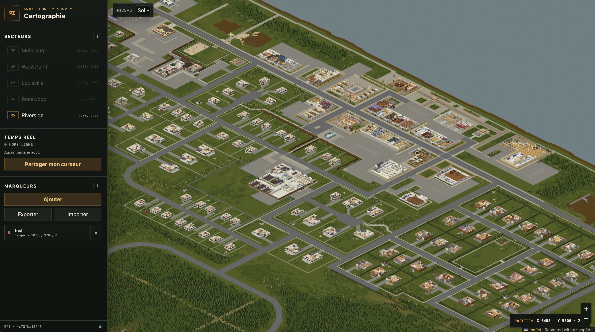

# Project Zomboid Map


Project Zomboid B41 map renderer, Leaflet web interface, and ephemeral
real-time cursor sharing service.



## Architecture

```text
.
├── webui/                  Static Leaflet application and Nginx image
├── server/                 Node.js and Socket.IO real-time service
├── pipeline/               pzmap2dzi rendering and tile normalization
├── docs/                   Screenshots and repository documentation assets
├── dist/                   Generated artifacts, ignored by Git
│   ├── map/                Map currently served by Nginx
│   ├── pipeline/           Resumable renders, logs, and spike output
│   └── archive/            Legacy local artifacts kept outside Git
├── Taskfile.yml            Generation and application lifecycle commands
└── compose.yaml            Local application orchestration
```

Each project owns its source, dependencies, container definition, and tests.
The repository root only contains shared documentation and orchestration.

The server follows a small hexagonal split:

- `domain/` validates positions without transport or storage concerns;
- `application/` implements live-session use cases;
- `adapters/inbound/` exposes those use cases through Socket.IO;
- `adapters/outbound/` stores sessions in memory;
- `index.js` is the composition root.

There is deliberately no database, framework HTTP, message broker, or shared
package until a concrete requirement needs one.

## Requirements

- Docker Desktop with Docker Compose
- [Task](https://taskfile.dev/) 3.50 or newer
- Node.js 22 or newer for local tests
- Python 3.10 or newer with Pillow for tile normalization
- Project Zomboid B41 assets for rendering
- 8-16 GiB assigned to Docker for the bounded-memory render profile

Copy `.env.example` to `.env` and set `PZ_ROOT` when using the renderer. The
path must directly contain the game's `media/` directory. The pipeline also
defaults to the usual Steam installation below `$HOME` on macOS.

## Start the application

The application serves whichever normalized map is published in `dist/map`:

```bash
task app:start
task app:status
task app:logs
task app:stop
```

If `dist/map/map-manifest.json` is missing, `app:start` generates Riverside
first. Open <http://localhost:8080> after startup. Compose starts both the web
interface and the real-time service. Nginx serves static files and tiles, and
proxies `/socket.io/` to the server.

To test cursor sharing, click **Partager mon curseur**, copy the reader link,
and open it in another tab. The link grants read access only. The publisher
token remains in the host tab's `sessionStorage`.

Live sessions are held in memory and expire after 24 hours without publisher
activity. Set `SESSION_TTL_MS` to override this duration.
Browser origins are restricted by `ALLOWED_ORIGINS`; update it when exposing
the application through another hostname.

## Render tiles

Use the named tasks to render either supported scope without remembering its
coordinates or output paths:

```bash
task generate:riverside
task generate:full
```

Both tasks publish the normalized result to `dist/map`, which is the directory
served by the WebUI. Riverside keeps resumable state in
`dist/pipeline/render/riverside`; the full map uses
`dist/pipeline/render/full`.

The default bounded-memory profile uses two workers, a 256 MiB tile cache, and
4 GiB of shared memory. Values can be overridden for one invocation:

```bash
task generate:full WORKERS=4 CACHE_MB=512 SHM_SIZE=6g
```

`PZ_ROOT` can be placed in `.env`; otherwise the pipeline uses the usual Steam
installation below `$HOME` on macOS.

Default outputs:

```text
dist/
├── map/                         Normalized map manifest and Leaflet tiles
└── pipeline/
    ├── logs/                    Timestamped build logs
    └── render/full/             Resumable pzmap2dzi output
```

A scope is rendered in one pzmap2dzi execution because independent source-cell
batches can overwrite shared downsampled tiles. pzmap2dzi still streams work
internally, and the render directory can be reused after interruption.

For a disposable smoke render:

```bash
./pipeline/scripts/build_tiles.sh \
  --scope 35,32,1,1 \
  --render-output dist/pipeline/render/smoke \
  --dist dist/smoke \
  --workers 2 \
  --cache-mb 256
```

The explicit 4 GiB shared-memory limit avoids Docker's 64 MiB default, which
is too small for pzmap2dzi's decoded texture cache.

## Renderer spike

The historical cell `35,32` validation remains available:

```bash
docker compose build renderer
docker compose run --rm renderer
```

Its output is written to `dist/pipeline/spike`. See `pipeline/SPIKE.md` for the
original measurements.

## Tests

```bash
npm --prefix webui ci
npm --prefix webui test
npm --prefix server ci
npm --prefix server test
python3 -m unittest discover -s pipeline/tests
bash -n pipeline/scripts/build_tiles.sh
docker compose config
docker compose up -d --build web
docker compose exec -T web nginx -t
```

The web tests cover isometric projection and share-link validation. The server
tests cover session lifecycle, authorization, rate limiting, late readers,
broadcasting, expiration, and explicit session termination.
